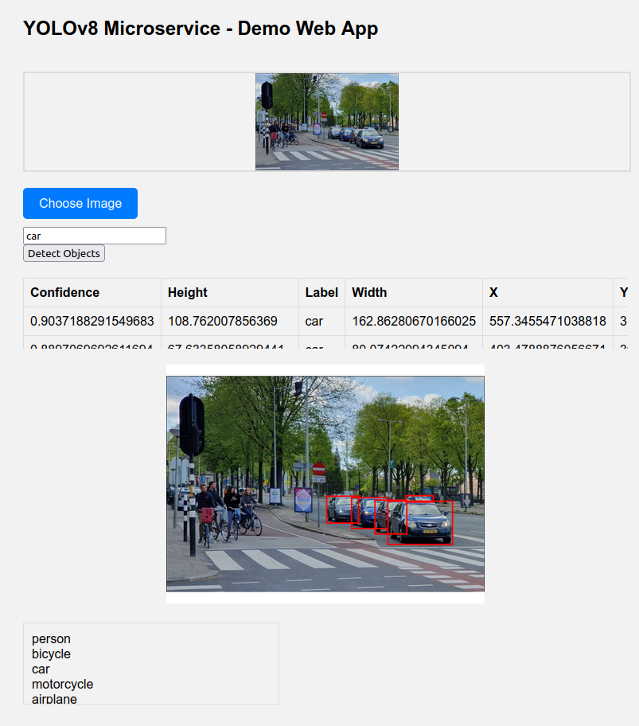

 # Object Detection Microservice

This is a Flask microservice for object detection using an ONNX model. It provides an endpoint for detecting objects in images uploaded to the server.

## Requirements

- Python 3.x
- Docker

## Installation


1. Clone this repository to your local machine:

   ```bash
   git clone https://github.com/ardaiynem/yolo-microservice.git
   ```

2. Navigate to the project directory:

   ```bash
   cd yolo-microservice
   ```
   
3. Build the Docker image:

   ```bash
   docker build -t yolo-microservice .
   ```

## Usage

### Running the Docker Container

To run the Docker container:

```bash
docker run -p 5000:5000 yolo-microservice
```

The microservice will be accessible at http://localhost:5000.

### Running with Docker Compose (Recommended)

Alternatively, you can use Docker Compose to simplify deployment:

```bash
docker compose up
```

This will start the Flask microservice container.

## API Documentation

Root Endpoint

- URL: /
- Method: GET
- Description: Webapp Demo Page for testing YOLO microservice.

Object Detection Endpoint

- URL: /detect/<label?>
- Method: POST
- Description: Detect objects in the uploaded image.
- Request Body: Form-data with a single file parameter named "file".
- Response: 

```json
{
    "image": "<base64 encoded image>",
    "objects": [
        {
            "label": "<label>",
            "x": <x-coordinate>,
            "y": <y-coordinate>,
            "width": <width>,
            "height": <height>,
            "confidence": <confidence>
        },
        ...
    ],
    "count": <number of objects detected>
}
```

## Configuration

- Modify the app.py file to change the object detection logic or add additional routes.
- Configuration settings such as model paths or server ports can be adjusted in the app.py file (and related Docker configration files).

## Testing

- With the user friendly web app, it is very use to test the microservice with easy requests



1. Choose an image file
2. Input a label within the textfield (You may check the scrollable list at the bottom of page for all possible labels accepted by YOLOv8 model)
3. Click 'Detect Objects' button

If there are any objects detected with the specified label, then the resulting specifications will be output in the table for each detected object.
You may use the images in test_images folder for testing.

## Making Requests to the `/detect` Endpoint Without Web App UI

To make requests to the `/detect` endpoint, follow these steps:

1. **Choose an Image**: Select an image that you want to use for object detection. Ensure that the image is in a format supported by the microservice (e.g., JPEG, PNG).

2. **Prepare the Request**:
   - Create a POST request to the endpoint URL (`http://localhost:5000/detect/<label>`), where `<label>` is replaced with the desired label for object detection.
   - Include the image file in the request body using the `file` parameter.

3. **Send the Request**:
   - If using `curl`, the command might look like this:
     ```bash
     curl -X POST -F "file=@path/to/your/image.jpg" http://localhost:5000/detect/your_label
     ```
   - If using Python's `requests` library, the code might look like this:
     ```python
     import requests

     url = 'http://localhost:5000/detect/your_label'
     files = {'file': open('path/to/your/image.jpg', 'rb')}
     response = requests.post(url, files=files)
     ```

4. **Receive the Response**:
   - The microservice will process the request and return a JSON response containing information about the detected objects in the image.
   - The response will include the base64-encoded image, a list of detected objects with their coordinates, labels, and confidence scores, and the total count of objects detected.

5. **Interpret the Response**: Parse the JSON response to extract the detected objects and their attributes as needed for further processing or display.

By following these steps, you can effectively make requests to the `/detect` endpoint with an image and a label specified in the URL path, allowing for flexible interaction with your microservice.


## License

This project is licensed under the MIT License.